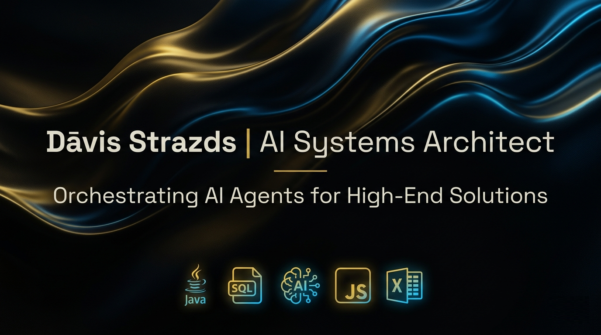

# Dāvis Strazds | AI Systems Architect Portfolio 🚀

### [🇱🇻 Latviešu](#-latviešu-valodā) | [🇬🇧 English](#-english-version)

---

[**🌐 Live Demo**](https://dawis86.github.io/davis-portfolio/) | [**📁 Repository**](https://github.com/dawis86/davis-portfolio) | [**📜 Technical Docs**](https://dawis86.github.io/davis-portfolio/docs/)

---
## 🇱🇻 Latviešu Valodā

### 🚀 Misija
Savienot cilvēka loģiku ar mākslīgā intelekta (AI) jaudu. Šis portfolio demonstrē unikālu karjeras transformāciju no sociālajām zinātnēm uz tehnisko arhitektūru, uzsverot, ka neatlaidība un sistēmiska domāšana ir atslēga nākotnes veidošanā.

### ✨ Galvenās Iezīmes
*   **Glassmorphism Dizains:** Moderna lietotāja saskarne, izmantojot progresīvus CSS3 filtrus un "Deep Night" estētiku.
*   **AI Laboratorija:** Interaktīva vide, kas demonstrē AI aģentu loģiku un personāžu apstrādi.
*   **Datu Simbioze:** Unikāls tehnoloģiju kopums, kas integrē Excel vidē sagatavotus datus ar Java loģiku un SQL datubāzēm.
*   **Daudzvalodu Atbalsts:** Pilnīga lokalizācija (LV/EN) profesionālai komunikācijai.

---

## 🇬🇧 English Version

### 🚀 Mission
Bridging the gap between human logic and AI-driven execution. This portfolio showcases a unique career transformation from social sciences to technical architecture, proving that architectural thinking is the cornerstone of future innovation.

### ✨ Key Features
*   **Glassmorphism Design:** Modern UI utilizing advanced CSS3 filters, radial gradients, and "Deep Night" luxury aesthetics.
*   **AI Laboratory:** An interactive environment demonstrating autonomous AI agent logic.
*   **Data Symbiosis:** Integration of Excel as a structured input terminal with Java engines and SQL persistence.
*   **Interactive Project Architecture:** Deep-dive project insights with dynamic 3D effects.

---

## 🛠 Tehnoloģiju Arsenāls / Technical Stack

| Kategorija / Category | Tehnoloģijas / Technologies |
| :--- | :--- |
| **Frontend** | HTML5, CSS3, JavaScript (ES6+), AOS, Prism.js, Vanilla Tilt |
| **Backend** | Java (POI, Business Logic), AI Agent Orchestration |
| **Data** | SQL (MySQL/SQLite), Excel Integration |
| **Tools** | Git, Google Apps Script, Web Audio API |

---

  
<i>Built with passion and AI-assisted precision by Dāvis Strazds.</i>

